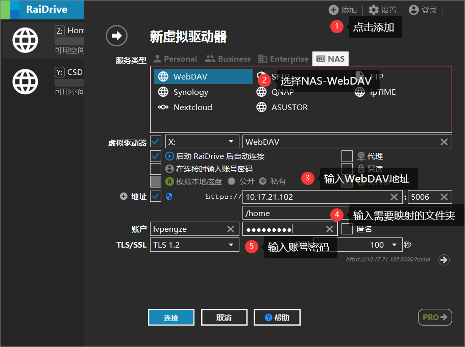
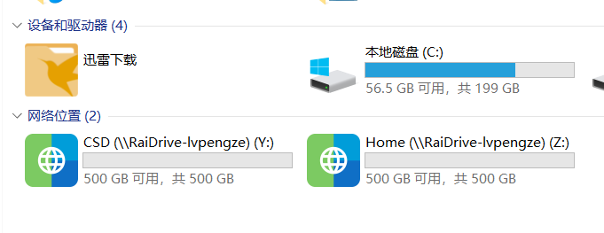
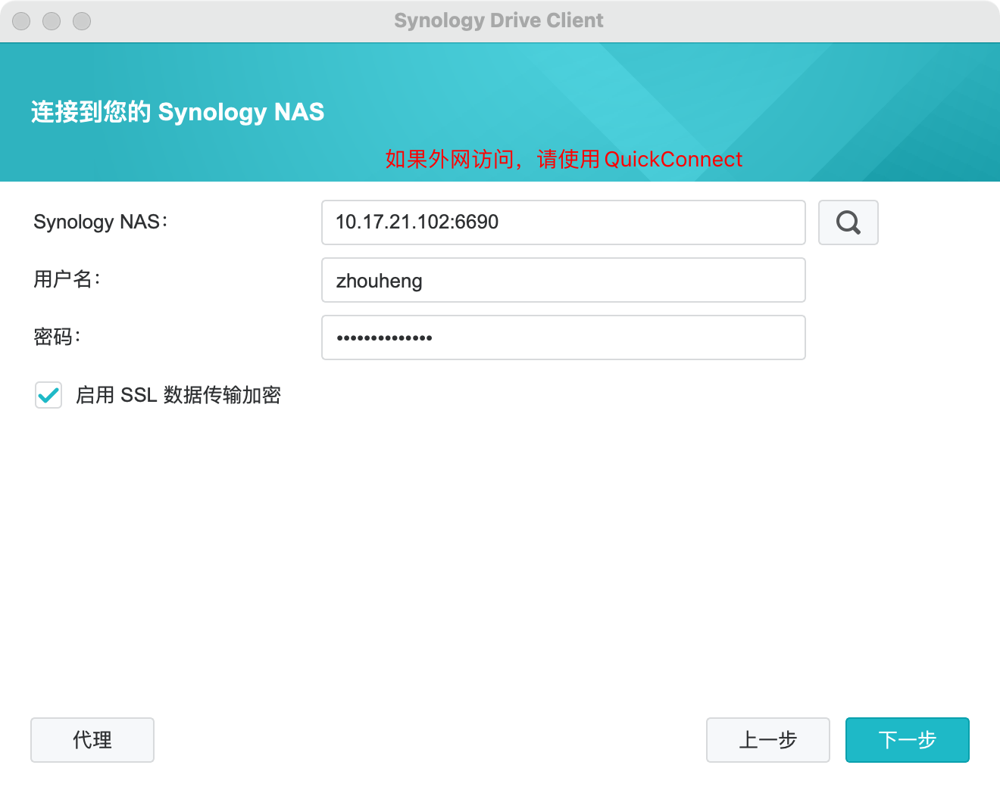
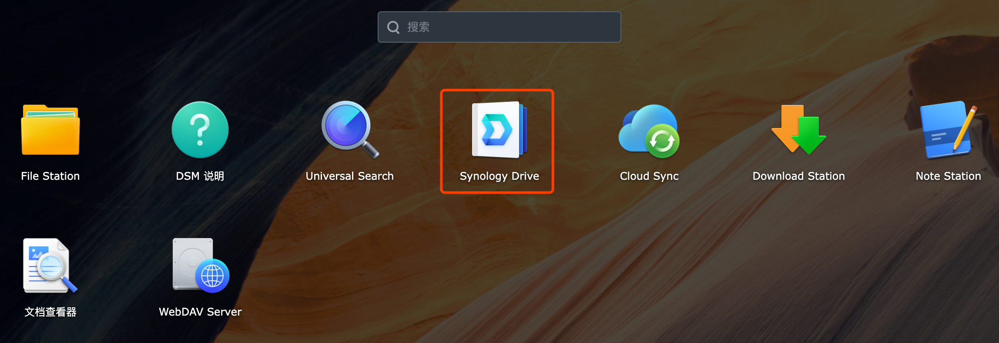
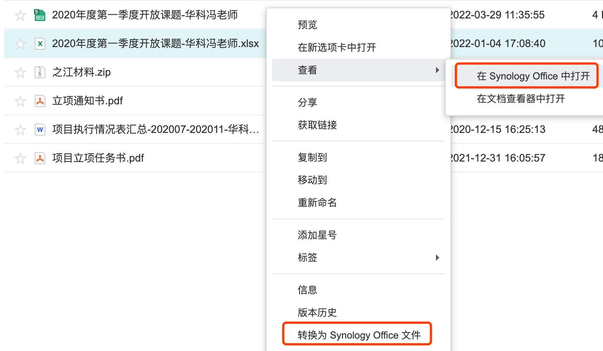

# NAS使用说明

NAS目前放在B508房间内，挂在软路由（10.17.21.102）之下，通过端口转发实现访问。

## 1 访问NAS

**QuickconnectID：`HUSTSSS-NAS`**

QC是群晖服务的唯一标识，使用群晖服务时，通过QCID便可在外网与NAS建立连接，缺点是速度较慢。内网请使用IP地址来访问。

NAS提供了多种文件协议，大家根据自己需要选择即可。

### 1.1 网页端DSM 

内网使用http://10.17.21.102 或者 https://10.17.21.102

外网使用[http://QuickConnect.cn/HUSTSSS-NAS](http://quickconnect.cn/HUSTSSS-NAS)

### 1.2 SMB服务

Windows：使用SMB服务，在资源管理器地址栏中输入：`\\10.17.21.102`，填写自己账号和密码即可

macOS：使用SMB服务，在访达菜单栏中选择`前往 -> 连接服务器`，点击加号新增`smb://10.17.21.102`，填写自己账号和密码即可	

> ⚠️注意：由于安全原因，学校内网屏蔽了SMB端口，所以在宿舍无法访问SMB服务（实验室可以正常访问），在实验室之外的校园网访问，请使用其他文件协议。
>

### 1.3 AFP服务（Apple）

苹果设备可通过AFP服务进行访问。

macOS：使用AFP服务，在访达菜单栏中选择`前往 -> 连接服务器`，点击加号新增`afp://10.17.21.102`，填写自己账号和密码即可	

### 1.4 FTP

填写IP地址即可，端口为默认21端口，**注意不要使用被动模式**。

### 1.5 WebDAV

http端口为5005，https端口为5006

### 1.6 使用RaiDrive将NAS映射为Windows磁盘
（1）安装RaiDrive

官网地址：https://www.raidrive.com/

安装包已上传到NAS中的 /HUSTSSS共享文件夹/Programmes/raidrive-2022-3-21.exe

（2）RaiDrive配置

```新建虚拟驱动器 -> 服务类型选NAS-WebDAV -> 填写WebDAV地址：https://10.17.21.102:5006 -> 填写账号密码```





## 2 文件同步

如果需要将本地文件与NAS进行同步，可使用Synology Drive进行同步，[下载链接](https://www.synology.cn/zh-cn/dsm/feature/drive)。Synology Drive提供版本控制，最多32个版本，目前设置的规则为8个版本。

内网访问：`10.17.21.102:6690`

外网访问：直接输入QuickConnectID即可，`HUSTSSS-NAS`



> ⚠️注意：
>
> 1. 首次同步如果选择其他同步盘（坚果云、Dropbox等）的文件夹进行同步，请先暂时退出其他同步盘，避免临时文件干扰。点击高级选项可选择同步时的过滤规则。
>
> 2. 内网访问不需要使用QuickConnect，点击不要使用。

## 3 共享文件夹说明

- home：每个用户独自私有空间
- HUSTSSS共享文件夹：用于组内文件共享，例如组内wiki、组会记录等，所有人都有读写权限进行访问
- PIM：PIM项目组共享文件夹
- CSD：CSD项目组共享文件夹

不同的研究小组可以设置自己的共享文件夹进行协同办公。小组自己的共享文件夹只限制总空间配额，不为每个人单独设置配额。

## 4 空间配额

- 学生默认每人500GB
- 老师默认每人1000GB
- HUSTSSS共享文件夹：总共500GB
- PIM共享文件夹：总共500GB
- CSD共享文件夹：总共500GB
- 其余小组共享空间需联系管理员

## 5 Synology Office套件

Offce套件属于Synology Drive套件，因此点击Synology Drive进入。



### 示例

选择Office文件，可以选择查看，也可选择转换成群晖Office文件（支持多人同时协作编辑）




## 官方文档

1. [DSM文档](https://kb.synology.cn/zh-cn/DSM/help/DSM/MainMenu/get_started?version=7)
2. [使用教程与常见问题](https://kb.synology.cn/zh-cn/search?sources%5B%5D=tutorial)
