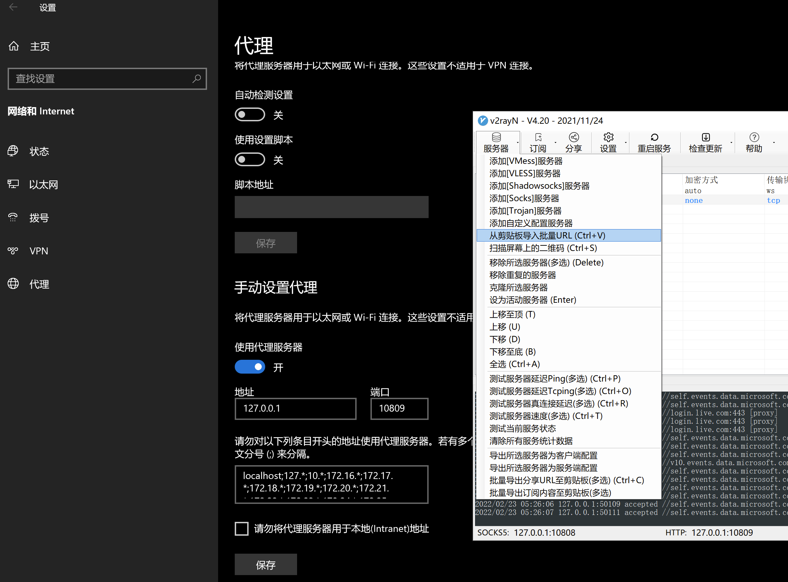
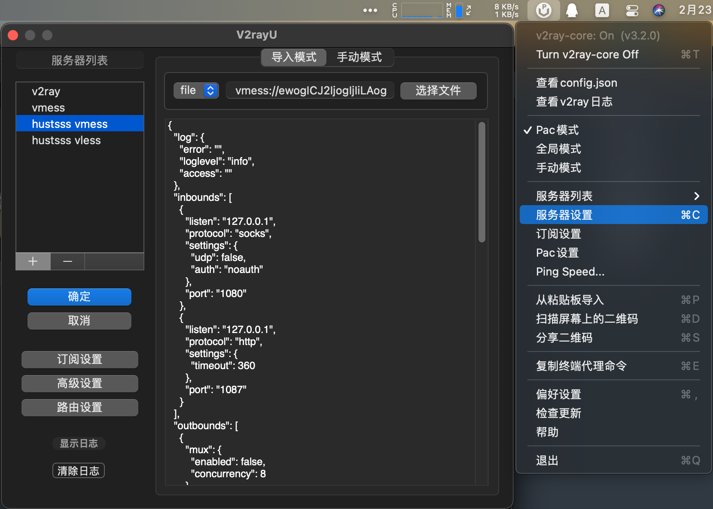

# 科学上网

## 前言

公共VPS提供两种协议的连接（VMESS和VLESS），选择其中一种即可，VLESS协议较新，支持的客户端比较少，VMESS协议大部分客户端都支持，因此根据自己操作系统平台选择能用的即可。选择好客户端就进行配置即可，每种协议提供了多种配置模式（协议链接、二维码、JSON、YAML），不同客户端支持的模式不同，需要自己选择，如果都不支持，根据原始配置自行配置客户端。

> ⚠️注意：开启代理后，访问IEEE、ACM等需要校园网IP进行验证的可能无法成功验证，大家需要将IEEE、ACM等网址添加到排除列表中，相关知识请根据相应的客户端进行学习配置。

## 客户端

客户端非常多，这里只列举几种常用的，其他客户端大家可以自行搜索并学习如何使用。

- Windows：Clash for Windows、v2rayN
- Linux：v2ray原生客户端+proxychains（参考后面命令行使用说明）
- macOS：Clash for Windows、v2rayU、clashX
- Android：Clash for Android、v2rayNG
- iOS：Shadowrocket

## v2rayN配置教程（Windows）

1. 下载最新版`v2rayN-Core.zip`：https://github.com/2dust/v2rayN/releases
2. 解压并打开
3. 复制vmess链接
4. 在v2rayN中点击 服务器 -> 从剪贴板导入批量URL
5. 在系统设置的代理选项中，打开手动设置代理，地址填写`127.0.0.1`，端口填写v2rayN软件最下方的HTTP端口，图中为10809
6. 测试Google连接



## v2rayU配置教程（macOS）

1. 下载最新版`v2rayU.dmg`：https://github.com/yanue/V2rayU/releases
2. 打开v2rayU，点击图标，选择服务器设置
3. 在下图所示的左侧服务器列表中点击"+"，在右侧的导入模式选择"URL"，右侧地址栏复制vmess链接，然后点击导入按钮，再点击左侧的确定保存
4. 测试Google连接



## 配置

### VMESS协议

原始配置（高级自定义，不可直接使用，需自己将配置转换成你所用客户端的配置）：

```Plain%20Text
协议: vmess
地址: vpn.hustsss.top
端口: 2053
uuid: 98e185b9-a809-4a4c-f99d-3fbd667e1199
alterId: 0
传输: ws
host: 无
path: /hustsss_top_vmess
tls: 开启
tls域名: vpn.hustsss.top
```

协议链接：

```Plain%20Text
vmess://ewogICJ2IjogIjIiLAogICJwcyI6ICJodXN0X3ZtZXNzX2NmIiwKICAiYWRkIjogInZwbi5odXN0c3NzLnRvcCIsCiAgInBvcnQiOiAyMDUzLAogICJpZCI6ICI5OGUxODViOS1hODA5LTRhNGMtZjk5ZC0zZmJkNjY3ZTExOTkiLAogICJhaWQiOiAwLAogICJuZXQiOiAid3MiLAogICJ0eXBlIjogIm5vbmUiLAogICJob3N0IjogIiIsCiAgInBhdGgiOiAiL2h1c3Rzc3NfdG9wX3ZtZXNzIiwKICAidGxzIjogInRscyIKfQ==
```

二维码：


JSON配置文件：

```JSON
{
  "log": {
    "error": "",
    "loglevel": "info",
    "access": ""
  },
  "inbounds": [
    {
      "listen": "127.0.0.1",
      "protocol": "socks",
      "settings": {
        "udp": false,
        "auth": "noauth"
      },
      "port": "1080"
    },
    {
      "listen": "127.0.0.1",
      "protocol": "http",
      "settings": {
        "timeout": 360
      },
      "port": "1087"
    }
  ],
  "outbounds": [
    {
      "mux": {
        "enabled": false,
        "concurrency": 8
      },
      "protocol": "vmess",
      "streamSettings": {
        "wsSettings": {
          "path": "/hustsss_top_vmess",
          "headers": {
            "host": ""
          }
        },
        "tlsSettings": {
          "allowInsecure": false
        },
        "security": "tls",
        "network": "ws"
      },
      "tag": "proxy",
      "settings": {
        "vnext": [
          {
            "address": "vpn.hustsss.top",
            "users": [
              {
                "id": "98e185b9-a809-4a4c-f99d-3fbd667e1199",
                "alterId": 0,
                "level": 0,
                "security": "aes-128-gcm"
              }
            ],
            "port": 2053
          }
        ]
      }
    },
    {
      "tag": "direct",
      "protocol": "freedom",
      "settings": {
        "domainStrategy": "UseIP",
        "userLevel": 0
      }
    },
    {
      "tag": "block",
      "protocol": "blackhole",
      "settings": {
        "response": {
          "type": "none"
        }
      }
    }
  ],
  "dns": {},
  "routing": {
    "settings": {
      "domainStrategy": "AsIs",
      "rules": []
    }
  },
  "transport": {}
}
```

Clash客户端YAML配置文件：

```YAML
allow-lan: false
bind-address: 127.0.0.1
dns:
  ake-ip-range: 198.18.0.1/16
  default-nameserver:
  - 114.114.114.114
  - 119.29.29.29
  - 223.5.5.5
  enable: true
  enhanced-mode: redir-host
  fallback-filter:
    geoip: true
    ipcidr:
    - 240.0.0.0/4
  ipv6: false
  nameserver:
  - https://223.5.5.5/dns-query
  - https://223.6.6.6/dns-query
  - https://doh.pub/dns-query
  use-hosts: true
external-controller: 127.0.0.1:19090
log-level: warning
mixed-port: 9981
mode: rule
proxies:
  # vmess
  # cipher support auto/aes-128-gcm/chacha20-poly1305/none
  - name: "hustsss_vmess_cf"
    type: vmess
    server: vpn.hustsss.top
    port: 2053
    uuid: 98e185b9-a809-4a4c-f99d-3fbd667e1199
    alterId: 0
    cipher: auto
    # udp: true
    tls: true
    # skip-cert-verify: true
    # servername: example.com # priority over wss host
    network: ws
    ws-opts:
      path: /hustsss_top_vmess
    #   headers:
    #     Host: v2ray.com
    #   max-early-data: 2048
    #   early-data-header-name: Sec-WebSocket-Protocol


proxy-groups:
  # select is used for selecting proxy or proxy group
  # you can use RESTful API to switch proxy is recommended for use in GUI.
  - name: Proxy
    type: select
    proxies:
      - hustsss_vmess_cf

rules:
- DOMAIN-KEYWORD,google,Proxy
- DOMAIN-KEYWORD,youtube,Proxy
- DOMAIN-SUFFIX,ggpht.com,Proxy
- DOMAIN-SUFFIX,gmail.com,Proxy
- DOMAIN-SUFFIX,gvt2.com,Proxy
- DOMAIN-SUFFIX,gvt3.com,Proxy
- DOMAIN-SUFFIX,chrome.com,Proxy
- DOMAIN-SUFFIX,wikipedia.org,Proxy
- DOMAIN-SUFFIX,wikimedia.org,Proxy
- DOMAIN-SUFFIX,appspot.com,Proxy
- DOMAIN-SUFFIX,android.com,Proxy
- DOMAIN-SUFFIX,github.com,Proxy
- DOMAIN-SUFFIX,gitbook.com,Proxy
- DOMAIN-SUFFIX,kaggle.com,Proxy
- DOMAIN-SUFFIX,arxiv.org,Proxy
- DOMAIN-SUFFIX,wiktionary.org,Proxy
- DOMAIN-SUFFIX,blogger.com,Proxy
- DOMAIN-SUFFIX,youtu.be,Proxy
- DOMAIN-SUFFIX,ytimg.com,Proxy
- DOMAIN-SUFFIX,youtube.com,Proxy
- DOMAIN-SUFFIX,instagram.com,Proxy
- DOMAIN-SUFFIX,twitter.com,Proxy
- DOMAIN-SUFFIX,t.co,Proxy
- DOMAIN-SUFFIX,facebook.com,Proxy
- DOMAIN-SUFFIX,telegram.org,Proxy
- IP-CIDR,192.168.0.0/16,DIRECT
- IP-CIDR,10.0.0.0/8,DIRECT
- IP-CIDR,172.16.0.0/12,DIRECT
- IP-CIDR,172.23.0.0/12,DIRECT
- IP-CIDR,127.0.0.0/8,DIRECT
- IP-CIDR,100.64.0.0/10,DIRECT
- IP-CIDR6,::1/128,DIRECT
- IP-CIDR6,fc00::/7,DIRECT
- IP-CIDR6,fe80::/10,DIRECT
- IP-CIDR6,fd00::/8,DIRECT
- GEOIP,CN,DIRECT
- MATCH,Proxy
```


### VLESS协议

原始配置（高级自定义，不可直接使用，需自己将配置转换成你所用客户端的配置）：

```Plain%20Text
协议: vless
地址: vpn.hustsss.top
端口: 443
uuid: 75a50cd9-ac8a-4456-ebfa-a5585eef2303
传输: ws
host: 无
path: /hustsss_top
tls: 开启
tls域名: vpn.hustsss.top
```

协议链接：

```Plain%20Text
vless://75a50cd9-ac8a-4456-ebfa-a5585eef2303@vpn.hustsss.top:443?type=ws&security=tls&path=%2Fhustsss_top&sni=vpn.hustsss.top#hust_vless_cf
```

二维码：


JSON配置文件：

```JSON
{
  "log": {
    "error": "",
    "loglevel": "info",
    "access": ""
  },
  "inbounds": [
    {
      "listen": "127.0.0.1",
      "protocol": "socks",
      "settings": {
        "udp": false,
        "auth": "noauth"
      },
      "port": "1080"
    },
    {
      "listen": "127.0.0.1",
      "protocol": "http",
      "settings": {
        "timeout": 360
      },
      "port": "1087"
    }
  ],
  "outbounds": [
    {
      "mux": {
        "enabled": false,
        "concurrency": 8
      },
      "protocol": "vless",
      "streamSettings": {
        "wsSettings": {
          "path": "/hustsss_top",
          "headers": {
            "host": ""
          }
        },
        "tlsSettings": {
          "allowInsecure": false
        },
        "security": "tls",
        "network": "ws"
      },
      "tag": "proxy",
      "settings": {
        "vnext": [
          {
            "address": "vpn.hustsss.top",
            "users": [
              {
                "encryption": "none",
                "id": "75a50cd9-ac8a-4456-ebfa-a5585eef2303",
                "level": 0,
                "flow": ""
              }
            ],
            "port": 443
          }
        ]
      }
    },
    {
      "tag": "direct",
      "protocol": "freedom",
      "settings": {
        "domainStrategy": "UseIP",
        "userLevel": 0
      }
    },
    {
      "tag": "block",
      "protocol": "blackhole",
      "settings": {
        "response": {
          "type": "none"
        }
      }
    }
  ],
  "dns": {},
  "routing": {
    "settings": {
      "domainStrategy": "AsIs",
      "rules": []
    }
  },
  "transport": {}
}

```

## 服务器命令行使用

先安装并配置好v2ray或xray客户端，然后选择上面对应协议的配置文件，配合环境变量`http_proxy`和`https_proxy`或者软件proxychains来使流量走代理，再也不用担心无法访问github了。

参考：

**[V2Ray 原生客户端命令行教程](https://docs.neobook.co/others/v2ray-yuan-sheng-ke-hu-duan-ming-ling-hang-jiao-cheng)**

**[Linux终端设置代理](https://v2xtls.org/linux终端设置代理/)**
